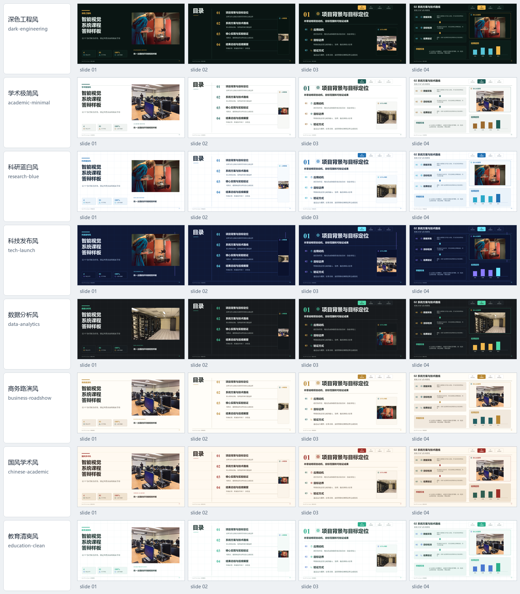
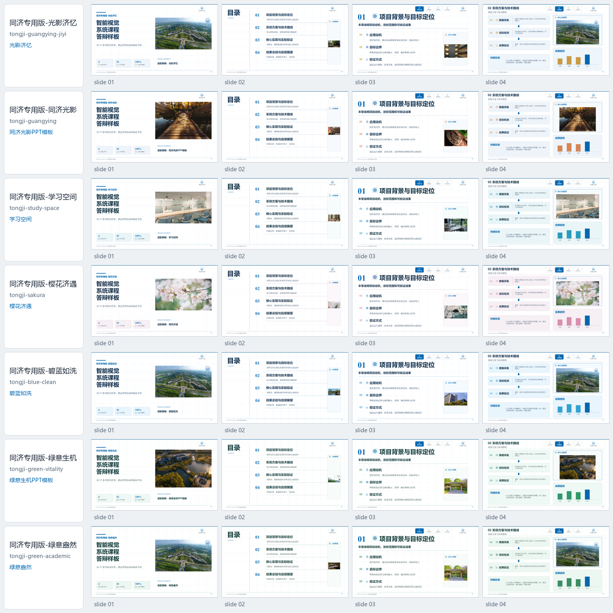
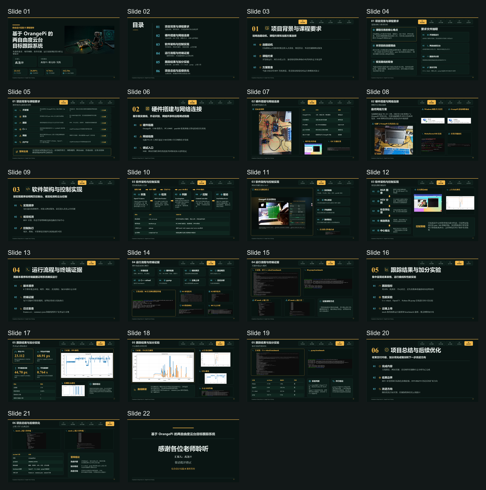

<h1 align="center">Shen-PPT</h1>

<p align="center">
  <a href="README.md">English</a> |
  <a href="README_CN.md">简体中文</a>
</p>

<p align="center">
  <strong>一个用于生成可编辑学术汇报与答辩 PPT 的 Codex Skill</strong>
</p>

<p align="center">
  <a href="https://github.com/yys806/Shen-PPT/actions/workflows/validate.yml"></a>
  <a href="https://github.com/yys806/Shen-PPT/tree/main"></a>
  <a href="references/style-samples-v2-20260606/sample-decks"></a>
  <a href="references/highest-references/orangepi-defense-final-v9-20260607"></a>
  <a href="SKILL.md"></a>
  <a href="LICENSE"></a>
</p>

<p align="center">
  <a href="#安装">安装</a> |
  <a href="#使用方式">使用方式</a> |
  <a href="#样板预览">样板预览</a> |
  <a href="#固定流程">固定流程</a> |
  <a href="#仓库校验">仓库校验</a>
</p>

Shen-PPT 是一个面向中文学术汇报、课程答辩、论文答辩和工程项目展示的 Codex Skill。它会读取用户提供的报告、代码文件夹、截图、图表、实验结果和参考材料，通过固定流水线生成可编辑的 PowerPoint 文件。

它的目标不是“看起来像 PPT 的图片”，而是生成真正可以点击、修改、替换的 PPTX：文字、图标、形状、流程图、表格、截图和图片都尽量保持独立可编辑或独立可替换。

## 适用场景

- 组会汇报
- 课程答辩
- 论文答辩
- 学术汇报
- 项目代码讲解
- 实验结果展示
- 同济大学蓝白/校徽风格 PPT

## 样板预览

### 通用风格样板

[](references/style-samples-v2-20260606/sample-decks)

### 同济风格样板

[](references/style-samples-v2-20260606/sample-decks)

### 最高质量参考

OrangePi 答辩 PPT 只作为质量参考，不作为通用模板复用。

[](references/highest-references/orangepi-defense-final-v9-20260607)

## Shen-PPT 解决什么问题

- 不按指定模板生成
- 字体乱用，页面风格漂移
- 把整页 PPT 做成不可编辑截图
- 页面太空，真实图片和结果表格太小
- 图标像矩形方块，或者为了装饰乱放
- 直接跳过大纲确认和四页样板确认
- 输出一大段英文状态，让用户不知道确认什么
- 只生成 PPT，忘记讲稿和可能问答

## 最终交付物

每次完整生成后，默认交付三件套：

| 文件 | 必须 | 说明 |
|---|---:|---|
| `{deck-title}.pptx` | 是 | 可编辑 PowerPoint 文件 |
| `{deck-title}_讲稿.md` | 是 | 根据最终 PPT 和材料生成的紧凑讲稿 |
| `{deck-title}_问答.md` | 是 | 老师可能提问与答辩回答 |

## 固定流程

Shen-PPT 必须像流水线一样运行，不能随意跳步、合并或替换流程。

| 阶段 | 名称 | 输出 |
|---:|---|---|
| 0 | 激活 | 加载规则、参数表和参考文件 |
| 1 | 信息确认 | 主题、材料、输出路径、受众 |
| 2 | 材料读取 | 读取报告、代码、图片、表格和结果 |
| 3 | 只生成大纲 | 页级大纲和素材安排，等待用户确认 |
| 4 | 模板/风格锁定 | 锁定指定模板或样板 PPT |
| 5 | 设计锁定 | 字体、导航、图标、密度、QA 规则 |
| 6 | 四页样板 | 首页、目录页、章节页、正文页，等待用户确认 |
| 7 | 完整生成 | 生成完整可编辑 PPTX |
| 8 | QA 修复 | 渲染预览，检查重叠、裁切、字体、密度 |
| 9 | 生成文档 | 生成讲稿和问答 |
| 10 | 交付 | PPTX + 讲稿 + 问答 |

## 核心视觉规则

- 中文大标题：`微软雅黑` 加粗
- 中文小标题、正文、汇报人/小组成员、模块标签：`方正小标宋简体`
- 英文和数字：`Times New Roman`
- 正文页只有一个大标题和一个正式小标题
- 右上角导航固定为两行：上方 `01/02`，下方四字短标签
- 真实截图、图表、结果表格、终端输出、实物照片优先使用
- 真实图片必须完整显示，允许缩放，不允许随意裁切
- AI 图片只作为局部素材，不生成整页 PPT 参考图
- 默认不加动画、不加切换效果
- 图标必须是真实语义线性图标或直接不用，禁止矩形方块假图标

## 模板库

所有 PPT 样板、参考图、参数表和最高参考都放在 `references/` 中。

| 类型 | 数量 | 位置 |
|---|---:|---|
| 通用可编辑样板 | 8 | `references/style-samples-v2-20260606/sample-decks/` |
| 同济可编辑样板 | 7 | `references/style-samples-v2-20260606/sample-decks/` |
| 最高质量参考 | 1 | `references/highest-references/orangepi-defense-final-v9-20260607/` |
| 参数规范 | 1 | `references/parameter-spec.md` |

可用风格 slug：

```text
academic-minimal
business-roadshow
chinese-academic
dark-engineering
data-analytics
education-clean
research-blue
tech-launch
tongji-blue-clean
tongji-green-academic
tongji-green-vitality
tongji-guangying
tongji-guangying-jiyi
tongji-sakura
tongji-study-space
```

## 仓库结构

```text
shen-ppt/
  SKILL.md
  README.md
  README_CN.md
  LICENSE
  references/
    parameter-spec.md
    highest-references/
    orangepi-defense-final-v9-20260607/
    style-samples-v2-20260606/
      sample-deck-map.json
      style-manifest.json
      sample-decks/
  scripts/
    validate-repo.ps1
```

仓库根目录保持干净。PPTX、预览图、参考 deck、contact sheet 和参数表都应该放进 `references/`。

## 安装

克隆到 Codex skills 目录：

```powershell
git clone https://github.com/yys806/Shen-PPT.git C:\Users\Lenovo\.codex\skills\shen-ppt
```

如果已经安装过：

```powershell
cd C:\Users\Lenovo\.codex\skills\shen-ppt
git pull
```

## 使用方式

在 Codex 中调用 `$shen-ppt`，并提供主题、材料路径和输出路径。

示例：

```text
[$shen-ppt](C:\Users\Lenovo\.codex\skills\shen-ppt\SKILL.md)
请帮我做课程答辩 PPT。
材料路径：D:\project\report 和 D:\project\code
输出路径：D:\project\ppt
风格：tongji-blue-clean
```

调用后，Shen-PPT 应该先读取材料并只生成大纲。大纲确认后，再锁定模板或视觉风格，然后生成四页样板。四页样板确认后，才会生成完整 PPT。

## 仓库校验

发布或修改前运行：

```powershell
powershell -ExecutionPolicy Bypass -File .\scripts\validate-repo.ps1
```

校验内容包括：

- 根目录没有误放 PPTX/PNG 参考文件
- `references/` 目录存在
- 15 套可编辑样板 PPTX 存在
- 通用/同济 overview 图片存在
- 最高参考 PPTX、contact sheet 和参数表存在
- `sample-deck-map.json` 能解析到真实样板文件

## License

MIT License.
